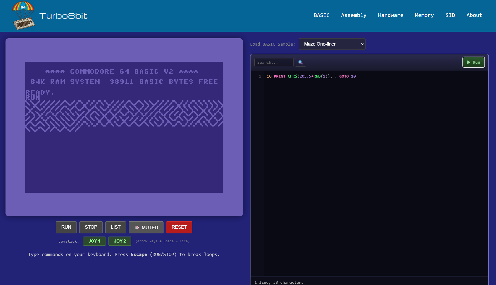

# Turbo8bit

Turbo8bit - learn about the Commodore 64 by coding in BASIC and 6502 assembler. 
JavaScript C64 emulator that takes you back to 1982.

Live at [Turbo8bit.com](https://Turbo8bit.com).



## Features

- **C64 History Timeline**: Key milestones from the C64's development through its legacy
- **Interactive C64 Emulator**: Full C64 emulation with BASIC, video, and SID audio
- **Hardware Block Diagram**: Interactive visualization of C64 hardware components
- **Memory Map Explorer**: Browse the complete C64 memory layout
- **SID Music Player**: Play classic SID tunes with an accurate emulator
- **PDF Library**: Collection of C64 programming books and references

## Emulator Architecture

The C64 emulator uses a unified architecture with cycle-accurate CPU and SID emulation:

```
C64Emulator (UI layer)
    ├── Web Audio API (ScriptProcessorNode)
    ├── Canvas rendering (384x272)
    └── Keyboard input handling
           │
           ▼
C64Machine (Bus interface)
    ├── MOS6510 CPU (cycle-exact 6502/6510)
    ├── SID chip (MOS6581/MOS8580 audio)
    ├── 64KB RAM
    ├── ROM mapping (BASIC $A000, KERNAL $E000)
    └── I/O mapping (VIC-II, SID, CIA1/2)
```

### Key Components

| Module | Description |
|--------|-------------|
| `machine.js` | C64Machine (motherboard) and C64Emulator (UI wrapper) |
| `mos6510.js` | Cycle-exact 6502/6510 CPU with Bus interface |
| `sid.js` | SID chip emulation + DAC modeling |
| `voice.js` | Voice, envelope generator, waveform generator |
| `filter.js` | SID filter (6581/8580) + external filter |
| `vic-ii.js` | VIC-II graphics chip with multiple display modes |
| `cartridge.js` | CRT cartridge format support with bank switching |
| `editor.js` | Syntax-highlighted code editor for BASIC and Assembly |
| `sidplayer.js` | PSID/RSID file player |
| `roms.js` | BASIC and KERNAL ROM data |

## SID Emulator

The SID emulator featuring:
- Full 6581/8580 waveform generation (triangle, sawtooth, pulse, noise)
- Envelope generator (ADSR)
- Programmable filter (low-pass, band-pass, high-pass)
- Cycle-accurate 6510 CPU for running SID player routines
- PSID/RSID file format support
- Web Audio API integration for real-time playback

## VIC-II Graphics

The VIC-II chip emulation supports all C64 graphics modes:
- **Standard Character Mode**: 40x25 characters, 16 colors
- **Multicolor Character Mode**: 40x25 characters, 4 colors per cell
- **Standard Bitmap Mode**: 320x200 hi-res graphics, 2 colors per 8x8 cell
- **Multicolor Bitmap Mode**: 160x200 graphics, 4 colors per 4x8 cell
- **Extended Background Color Mode**: 64 characters with 4 background colors

## CRT Cartridge Support

The emulator supports CRT cartridge files (CCS64/VICE format):
- 27 cartridge hardware types (Normal, Ocean, Action Replay, Final Cartridge III, etc.)
- Automatic bank switching for multi-bank cartridges
- EXROM/GAME line configuration for memory mapping
- I/O space handlers at $DE00-$DFFF
- Reset button ejects cartridge and returns to BASIC

## License

MIT
