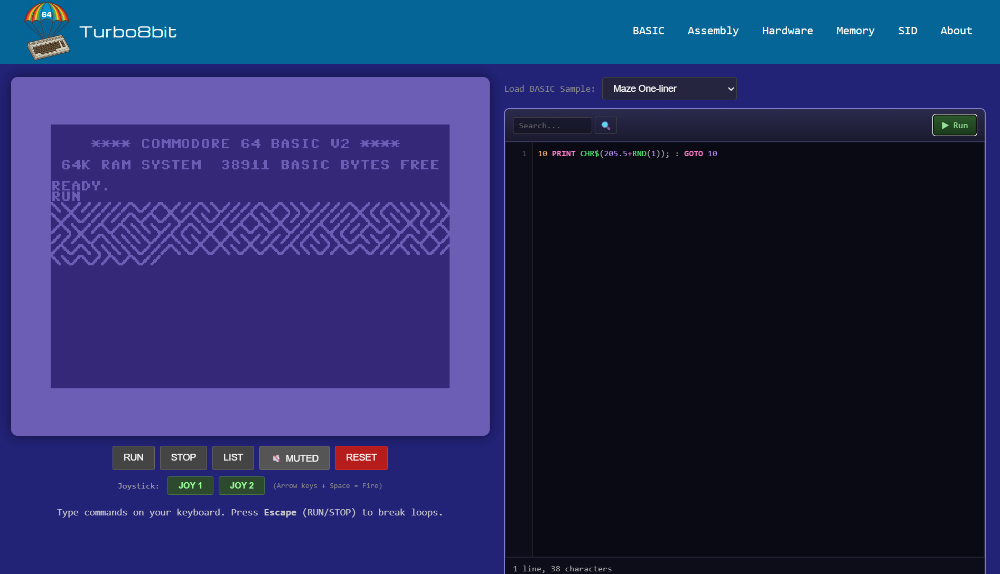

# Turbo8bit

Learn about the Commodore 64 by coding in BASIC and 6502 assembler. A C64
emulator written from scratch in JavaScript, wrapped in a site that explains the
machine it is emulating.

Live at [turbo8bit.com](https://turbo8bit.com).



## Pages

| Route | What it does |
|-------|--------------|
| `/` | BASIC lab — type into a live C64, or write BASIC in the editor and load it straight into memory |
| `/asm` | Assembly lab — assemble 6502, single-step it, and watch the registers and flags change |
| `/hardware` | Bus simulator — watch the chips talk over the address and data buses, plus a chip reference |
| `/memmap` | Memory map explorer — see how banking maps ROM, RAM and I/O into the same 64KB |
| `/sid` | SID player — play SID tunes with a live voice, filter and register visualiser |
| `/about` | What the site is and who made it |

These six come from `SITE_PAGES` in [web/main.py](web/main.py), which also drives
the nav and `sitemap.xml`. `/robots.txt`, `/sitemap.xml` and `/auth/*` are served
alongside them.

## Quick start

Requires Python 3.10+ and PowerShell.

```powershell
python -m venv .venv
.\.venv\Scripts\Activate.ps1
pip install -r web\requirements.txt
pip install pytest py_mini_racer

.\dd.ps1 run     # http://localhost:8082
```

`dd.ps1` is the entry point for everything:

| Command | Description |
|---------|-------------|
| `.\dd.ps1 run` | Local dev server on http://localhost:8082 |
| `.\dd.ps1 test` | Run the test suite (pytest) |
| `.\dd.ps1 format` | Format Python with Black (`-Check` reports instead of rewriting) |
| `.\dd.ps1 gen` | Regenerate favicons and the social image from `raw-images/favicon.png` |
| `.\dd.ps1 crt` | Publish CRT cartridge files to Cloud Storage |
| `.\dd.ps1 deploy` | Deploy to Google App Engine (`-NoPromote`, `-Version <ver>`) |
| `.\dd.ps1 help` | Show all commands |

Sign-in and session cookies need secrets. Copy `web/secrets.example.yaml` to
`web/secrets.yaml` and fill it in — the file is git-ignored, `app.yaml` pulls it
in via `includes:`, and `deploy` refuses to run without it.

## Emulator architecture

```
C64Emulator (emulator.js)          SIDPlayer (sid-player.js)
  canvas + Web Audio + keyboard      Web Audio + tune visualisation
                    └────────┬────────┘
                             ▼
                  C64Machine (machine.js)
                  the bus: read(addr) / write(addr, val)
    ├── MOS6510      6502/6510 CPU with per-instruction cycle counts
    ├── VIC-II       scanline renderer, all 5 display modes, sprites
    ├── SID          MOS6581/MOS8580 with DAC, filter and ADSR modelling
    ├── CIA1/CIA2    timers, IRQ/NMI lines, keyboard matrix, joysticks
    ├── 64KB RAM     with $01 banking
    └── ROM/IO       BASIC $A000, KERNAL $E000, Char ROM, I/O $D000-$DFFF
```

Everything the CPU touches goes through `C64Machine.read`/`.write`, so banking,
I/O and cartridge mapping are decided in exactly one place.

### Modules

| Module | Purpose |
|--------|---------|
| `emulator.js` | `C64Emulator` — canvas rendering, Web Audio, keyboard, drag-and-drop. Entry point for `/` and `/asm` |
| `sid-player.js` | `SIDPlayer` and PSID/RSID parsing. Entry point for `/sid` |
| `machine.js` | `C64Machine` — the bus, banking, CIA timers, keyboard matrix, frame loop |
| `mos6510.js` | The CPU. All 256 opcodes including the undocumented ones |
| `vic-ii.js` | Scanline graphics renderer and sprites |
| `sid.js` | SID chip, DAC modelling and resampling |
| `voice.js` / `filter.js` | Oscillators, ADSR envelopes, and the 6581/8580 filters |
| `psid-driver.js` | The small 6502 driver that runs a SID tune's init/play routines |
| `cartridge.js` | CRT format and bank switching |
| `assembler.js` | 6502 assembler and disassembler |
| `basic-tokenizer.js` | BASIC V2 tokenizer and syntax highlighting |
| `debugger.js` | Stepping, breakpoints and memory inspection |
| `editor.js` | Syntax-highlighted code editor |
| `roms.js` | BASIC, KERNAL and character ROM data |

## What the emulator covers

**CPU** — all 151 documented opcodes plus the undocumented ones (LAX, SAX, DCP,
ISB, SLO, RLA, SRE, RRA, ANC, ALR, ARR, SBX, LXA, LAS, ANE, SHA/SHX/SHY/TAS and
the JAM opcodes), with per-instruction cycle counts including page-crossing
penalties, BCD arithmetic, and the `JMP ($xxFF)` page-wrap bug.

**VIC-II** — rendered a scanline at a time, so raster interrupts can change
registers mid-frame and split-screen effects work. All five display modes
(standard and multicolor character, standard and multicolor bitmap, extended
background colour), 8 hardware sprites with multicolor, X/Y expansion, priority
and collision latches, plus smooth scrolling, 24-row and 38-column border
masking, VIC bank selection and Bad Line CPU stalling.

**SID** — 6581 and 8580 waveform generation with combined-waveform tables, ADSR
envelopes, ring modulation and oscillator sync, the resonant multi-mode filter,
non-linear DAC modelling and an external filter stage. Register writes are
timestamped by CPU cycle and applied at the right point in the sample stream.

**CIA** — Timer A/B on both chips in one-shot and continuous modes, Timer B
counting Timer A underflows, IRQ from CIA1 and NMI from CIA2 (used by digi
playback), the 8×8 keyboard matrix scanned in both directions, and two joysticks.

**Cartridges** — the CRT container format (CCS64/VICE), with bank switching
through the `$DE00-$DFFF` I/O window for the common hardware types (Normal,
Ocean, Action Replay, Final Cartridge III, EasyFlash and others) and EXROM/GAME
line handling for 8K, 16K and Ultimax modes. Drop a `.crt` or `.prg` onto the
emulator screen to load it.

Timing is accurate per instruction rather than per cycle: the CPU runs whole
instructions and the VIC-II steals a flat 40 cycles on a Bad Line, so effects
that depend on sub-instruction bus timing or sprite DMA will not be exact.

## Testing

Tests run the emulator's JavaScript inside Python using
[py_mini_racer](https://github.com/bpcreech/PyMiniRacer), so the CPU, SID, VIC-II
and cartridge code are all covered without a browser.

```powershell
.\dd.ps1 test
```

Some cartridge tests skip unless the matching CRT dump is present locally — CRT
files live in Cloud Storage rather than in the repo.

## License

MIT
